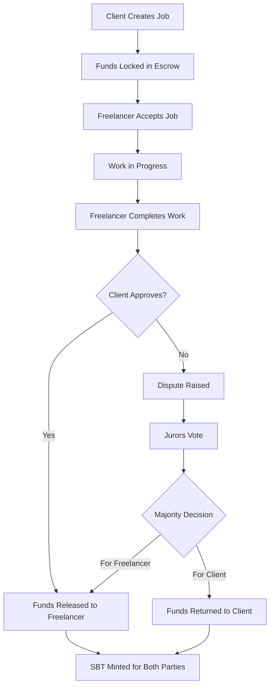

# 🚀 Ellora Phase 2: Smart Contract Development

Welcome to **Phase 2** of the Ellora freelance marketplace! This phase introduces decentralized smart contracts, on-chain escrow, and reputation systems powered by Algorand blockchain.

## ✨ **New Features in Phase 2**

### 🔒 **Smart Contract Escrow System**
- **Trustless Payments**: Clients deposit ALGO into smart contracts
- **Automatic Fund Release**: Payments released when work is approved
- **Dispute Resolution**: Decentralized jury system for conflicts
- **Multi-Signature Security**: Enhanced transaction security

### 🏆 **Reputation System (SBT)**
- **Soulbound Tokens**: Non-transferable reputation tokens
- **On-Chain Reputation**: Immutable track record stored on Algorand
- **Juror Eligibility**: High-reputation users can resolve disputes
- **Rating System**: 5-star rating system with weighted scores

### 💼 **Enhanced Job Management**
- **Blockchain-Verified Jobs**: All jobs backed by smart contracts
- **Real-Time Status Tracking**: Monitor job progress on-chain
- **Automated Workflows**: Smart contract-driven job lifecycle
- **Transparent Payments**: All transactions visible on Algorand

## 🏗 **Technical Architecture**

### Smart Contracts

#### 1. **Escrow Contract** (`escrow_contract.py`)
```python
# Core functionalities:
- create_job()      # Client creates job with payment
- accept_job()      # Freelancer accepts the job
- complete_job()    # Freelancer marks job complete
- approve_completion() # Client approves and releases funds
- raise_dispute()   # Either party can dispute
- vote_dispute()    # Jurors vote on disputes
```

#### 2. **Reputation SBT Contract** (`reputation_sbt.py`)
```python
# Core functionalities:
- mint_sbt()        # Award reputation tokens
- update_rating()   # Update user ratings
- check_eligibility() # Check if user can be juror
- get_reputation()  # Get user's reputation score
```

### Frontend Integration

#### New Components:
- **JobCreationModal**: Create jobs with smart contract integration
- **ContractService**: Interact with Algorand smart contracts
- **Enhanced Dashboard**: Real-time blockchain data
- **Reputation Display**: Show on-chain reputation scores

## 🔧 **Installation & Setup**

### Prerequisites
- Python 3.8+ (for PyTEAL)
- Node.js 18+ (for frontend)
- Algorand Testnet account with ALGO

### 1. Install Smart Contract Dependencies
```bash
# Install PyTEAL and Algorand SDK
pip3 install pyteal py-algorand-sdk

# Verify installation
python3 -c "import pyteal; print('PyTEAL installed successfully')"
```

### 2. Smart Contract Development
```bash
# Navigate to smart contracts directory
cd smart-contracts/contracts

# Compile contracts (generates TEAL code)
python3 escrow_contract.py
python3 reputation_sbt.py
```

### 3. Deploy to Algorand Testnet
```bash
# Get testnet ALGO from dispenser
# Visit: https://testnet.algoexplorer.io/dispenser

# Deploy contracts
cd ../scripts
python3 deploy_contracts.py
```

### 4. Update Frontend Configuration
```typescript
// After deployment, update contract IDs in contractService.ts
const TESTNET_CONFIG: ContractConfig = {
  escrowAppId: YOUR_ESCROW_APP_ID,    // From deployment
  sbtAppId: YOUR_SBT_APP_ID,          // From deployment
  network: 'testnet'
};
```

## 🎯 **How to Use**

### For Clients (Job Posters)

1. **Connect Pera Wallet**
   - Click "Connect Wallet" in the navbar
   - Approve connection in Pera Wallet app

2. **Create a Job**
   - Click "Create Job" button on dashboard
   - Fill in job details (title, description, budget, deadline)
   - Set requirements for freelancers
   - Submit transaction to blockchain

3. **Manage Jobs**
   - View job status in real-time
   - Approve completed work to release funds
   - Raise disputes if needed

### For Freelancers

1. **Accept Jobs**
   - Browse available jobs on dashboard
   - Accept jobs that match your skills
   - Start working on accepted projects

2. **Complete Work**
   - Mark jobs as completed when finished
   - Wait for client approval
   - Receive payment automatically via smart contract

3. **Build Reputation**
   - Complete jobs successfully to earn SBT tokens
   - Maintain high ratings to become eligible as a juror
   - Participate in dispute resolution for additional rewards

### For Jurors (High-Reputation Users)

1. **Eligibility Requirements**
   - Minimum 10 completed jobs (SBT tokens)
   - Reputation score of 70% or higher
   - Good standing in the community

2. **Dispute Resolution**
   - Vote on disputed jobs
   - Review evidence from both parties
   - Cast fair and informed votes
   - Earn juror rewards for participation

## 📊 **Smart Contract Workflow**



## 🔐 **Security Features**

### Smart Contract Security
- **Reentrancy Protection**: Prevents recursive calls
- **Access Control**: Only authorized users can call functions
- **State Validation**: Ensures contract state consistency
- **Fund Safety**: Escrow protects both parties' interests

### Pera Wallet Integration
- **Hardware Wallet Support**: Enhanced security for large amounts
- **Transaction Signing**: All transactions signed locally
- **Account Isolation**: Each user controls their own keys
- **Testnet Safe**: All development on Algorand testnet

## 🧪 **Testing**

### Smart Contract Tests
```bash
# Run contract tests
cd smart-contracts/tests
python3 test_escrow.py
python3 test_reputation.py
```

### Frontend Tests
```bash
# Test wallet integration
npm run test

# Test contract service
npm run test:contracts
```

## 📈 **Monitoring & Analytics**

### Blockchain Data
- **Transaction History**: View all contract interactions
- **Job Statistics**: On-chain job completion rates
- **Reputation Metrics**: User rating distributions
- **Network Activity**: Real-time blockchain monitoring

### Tools
- **AlgoExplorer**: https://testnet.algoexplorer.io/
- **Pera Wallet**: Mobile app for transaction signing
- **Goal CLI**: Command-line Algorand tools

## 🚀 **Next Steps (Phase 3)**

### Planned Features
- **Multi-Asset Support**: USDC, other ASAs
- **Advanced Dispute System**: Multi-tiered resolution
- **Governance Token**: Community voting on platform changes
- **Cross-Chain Integration**: Bridges to other blockchains
- **AI-Powered Matching**: Smart freelancer-job matching

### Performance Improvements
- **Layer 2 Solutions**: State channels for frequent interactions
- **Batch Processing**: Multiple jobs in single transaction
- **Caching Layer**: Faster blockchain data retrieval
- **Progressive Web App**: Mobile-optimized experience

## 🔗 **Resources**

### Documentation
- [Algorand Developer Portal](https://developer.algorand.org/)
- [PyTEAL Documentation](https://pyteal.readthedocs.io/)
- [Pera Wallet Connect](https://github.com/perawallet/connect)

### Community
- [Algorand Discord](https://discord.gg/algorand)
- [Ellora GitHub](https://github.com/ellora-marketplace)
- [Developer Forum](https://forum.algorand.org/)

### Support
- 📧 Email: dev@ellora.marketplace
- 💬 Discord: #ellora-support
- 🐛 Issues: GitHub Issues tab

---

## 🎉 **Congratulations!**

You've successfully implemented Phase 2 of Ellora! Your freelance marketplace now features:

✅ **Decentralized Escrow System**  
✅ **On-Chain Reputation Management**  
✅ **Dispute Resolution Framework**  
✅ **Real Blockchain Integration**  
✅ **Smart Contract Security**  

Your platform is now truly decentralized and ready for the next phase of development! 🌟 